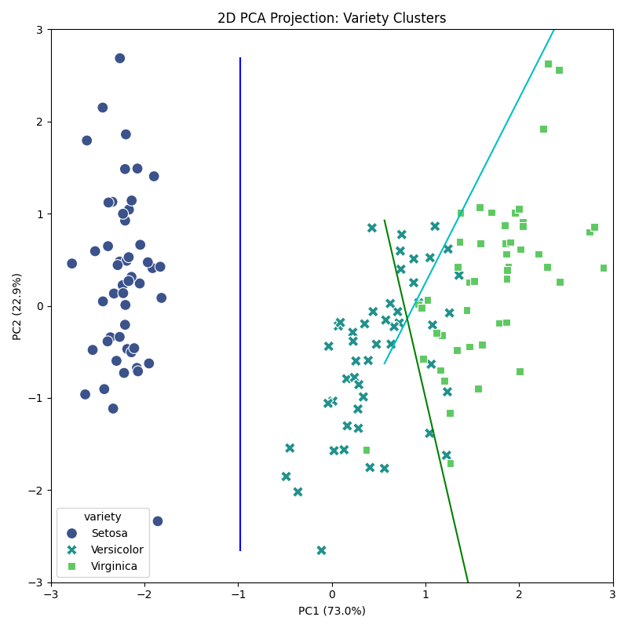
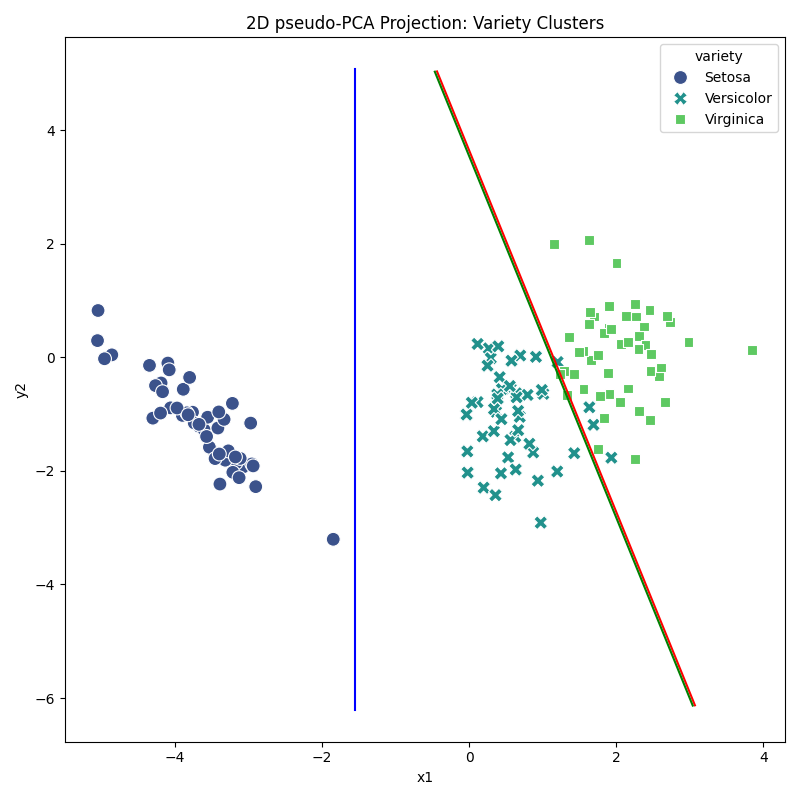
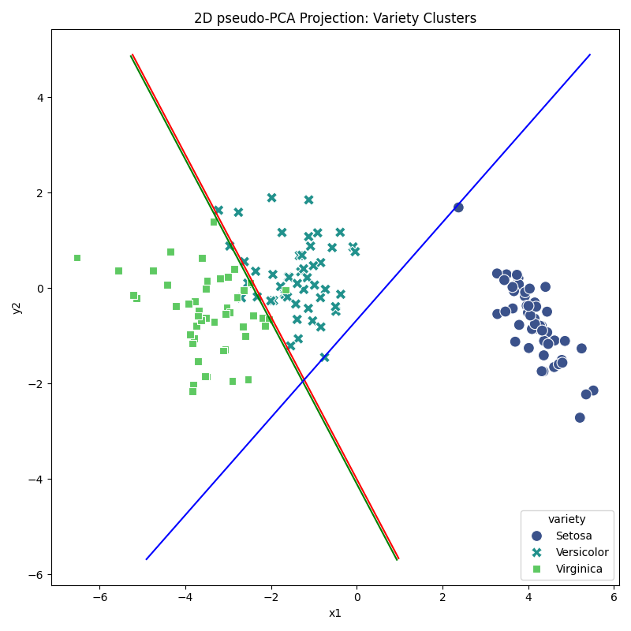

# Visual Iris: A Journey into Explainable & Frugal AI
> *“Using the world’s most famous dataset as a transparent laboratory to understand, optimize, and visualize the mechanics of machine intelligence.”*

A companion set of eyes-centric (visually enriched) python codes toward explainable AI (XAI) and other didactic purposes 

**How to use toward best results**

The repo is organized in the following way:
* Its **root folder** contains all you need to get started - e.g. the minimum *requirements* file and a fully functional 
*PyTorch* script that implements and then runs (inference, training etc) the well-known **baseline** version of
the *Iris Flowers* classifier MLP network model. This baseline model is then examined under the magnifying glass of
progressively more elaborate approaches toward the model's better understanding and further refinement.   
These approaches have dedicated subfolders as described below.
<br>
Note: Representative figure examples provide a visual intuition as to what to expect from these approaches.

# Part 1: Introduction

This repository provides an introductory framework for exploring connectionist models through the lens of Explainable AI (XAI) and structural optimization. It aims to bridge the gap between high-level neural network performance and intuitive human understanding.
The repository is organized around a technical progression from the 'classic' neural network implementation baselines toward optimized and statistically grounded architectures. 
<br>
The work is divided into four stage Levels:

---

* **Level 1: Baseline Implementation** – Establishes a benchmark using a 4-8-9-3 Multi-Layer Perceptron (MLP). This stage covers data acquisition, preprocessing, and the fundamental mechanics of connectionist training.

* **Level 2: Interpretability and Visualization** – Focuses on the visual unfolding of hidden layer activity. This section addresses Explainable AI (XAI) through the observation of decision boundaries and unit activations.

* **Level 3: Statistical Grounding** – Benchmarks the neural network against Principal Component Analysis (PCA) and Fisher Linear Discrimination (FLD). It evaluates whether connectionist complexity is required or whether closed-form statistical solutions offer alternatives and comparable performance.

* **Level 4: Architectural Optimization** – Demonstrates parameter reduction by utilizing statistical priors to pre-train specific layers. The process transitions from a 151-parameter model to a 12-parameter output mapping while maintaining the classification accuracy.

---

## 🛠️ Environment Configuration

This project is designed for a minimal footprint and maximum compatibility.

1. **Repository Initialization:**
```bash
git clone https://github.com/nedialko1/visual-iris.git
cd visual-iris
```

CUDA Configuration: If utilizing a GPU, verify your version in requirements.txt. 
The CUDA version assumed is 12.4.

2. **Dependency Installation:**

```bash

pip install -r requirements.txt
```

---

# Part 2: Technical Progression & Guidelines

## 🟢 Level 1: Baseline Implementation (`/start_here`)
**"Foundations of the Multi-Layer Perceptron (MLP)."**

An introduction to a 'classic' standard MLP (4-8-9-3) architecture using PyTorch.

* **Goal:** Establish a performance benchmark.
* **Action:** Execute `python baseline_classifier.py` from the root directory.
* **Metrics:** The script initializes 151 parameters. This baseline serves as the control group for all subsequent optimizations experiments.


> ### 🔲 **To reproduce Fig. 1.1**
> 
> To reproduce the dataset distribution shown in **[Fig. 1.1]**, please execute the following source script:
> 
> ```bash
> python load_uci_data.py
> ```

---

## 🟡 Level 2: Interpretability & Visualization (`/da_Visual_Iris`)
**"Decoding the Black Box: Visualizing Activation Patterns."**

This section focuses on the visual unfolding of the connectionist model to achieve Explainable AI (XAI).

* **Action:** Navigate `cd da_Visual_Iris` and execute `python visual_iris_main.py`.
* **Interaction:** Manipulate the layer-specific sliders to observe how thresholding affects decision boundaries in real-time.

* **Key Feature: Activation Thresholding.** Interactive controls allow for the manual setting of unit firing thresholds.
* **Objective:** Observe the potential transition from continuous rate coding to sparse activation patterns, exploring the prerequisites for Spiking Neural Networks (SNN).

 
 


---

## 🟠 Level 3: Statistical Grounding (`/Statistical_Iris`)
**"Comparative Analysis: Neural Networks vs. Statistical Parsimony."**

An juxtaposition of connectionist learning against classical Principal Component Analysis (PCA) and Fisher Linear Discrimination (FLD).

* **Action:** Navigate `cd Statistical_Iris` and execute `python GUI_data.py`.
* **Interaction:** Manipulate the mouse to define PWL decision boundaries.

* **Key Finding:** Classical statistical methods can achieve robust discrimination using closed-form solutions with fewer parameters.
* **Structural Observation:** We visualize instances where over-parameterized models achieve accuracy despite the hidden layers failing to represent the underlying problem geometry.

 
 

 
 


---

## 🔴 Level 4: Architectural Optimization (`/Pretrained_Iris`)
**"Frugality: The 12-Parameter Challenge."**

This part demonstrates the reduction of model complexity through informed architectural design.

* **Action:** Run `python extreme_optimizer.py`.
* **Objective:** Demonstrate that informed initialization based on statistical priors significantly reduces the training overhead and parameter count.

* **Key Finding:** 
  The **Architectural Evolution:**
  - 1. **Baseline:** 151 parameters.
  - 2. **Compressed:** 48 parameters (4-4-3-3).
  - 3. **Optimized:** 36 [actually 12] parameters (4-3-3-3), utilizing fixed PCA/FLD weights.
* **Structural Observation:** The 12-Parameter Performance: Achieving **97.34% accuracy** by training solely the output mapping layer.

 

 
 


---

## 📈 Summary
Structural optimization is the intersection of mathematical elegance and computational efficiency. The figures provided here illustrate that explainability is not a byproduct, but a requirement for robust AI design.

*For theoretical depth, refer to: **"Frugal Explainable AI/ML Model Optimization"
--- 

## 🏛️ Methodological Postscript 

### A "Russian Doll" Approach to Observability 
The transition from the minimalist Iris dataset to production-scale architectures may be managed through a hierarchical abstraction we may call the **Russian Doll strategy**. To maintain observability in complex systems, the model is treated as a nested structure: individual neurons reside within layers, layers within modules, and modules within subsystems. By mastering the visualization of the "innermost doll"—the basic unit of the Iris classifier—one develops the structural intuition required to zoom out and interpret the behavior of larger-scale, high-dimensional systems without losing sight of the underlying mechanics. 

### On AI Agency and the Human Architect 
The implementation of this repository reflects a contemporary collaboration between human intent and AI agency. While the source code was generated through the lens of modern AI tools, the underlying engineering strategies, mathematical derivations, and optimization logic remain 100% human-original. In this paradigm, the AI acts as a high-fidelity technical executor—a "digital compiler" for human-prescribed recipes—ensuring that the final code adheres to rigorous, verbatim design requirements while the architect remains the sole source of the algorithmic innovation. 

### 📚 Companion Resource 
This repository is designed to be explored alongside the full article: **"Frugal Explainable AI/ML Model Optimization - a Hands-On Introduction."** The text provides the theoretical depth and statistical proofs behind the parsimonious architectures demonstrated here, serving as a comprehensive guide for those seeking to move beyond "black-box" modeling and toward truly explainable engineering. 

---
