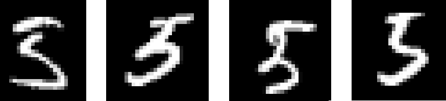
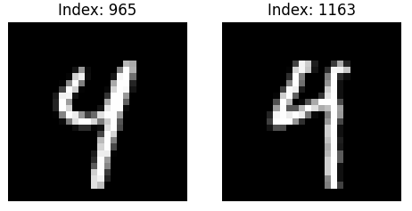
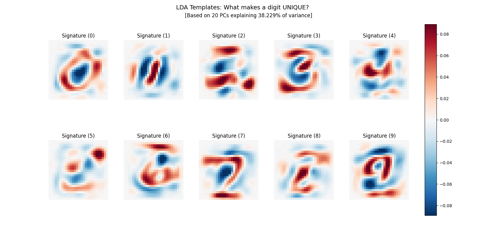

The **etc_MNIST** folder provides the something of an *Appendix* to the rest of the story.

The MNIST **over-97%-correct** classification of the convolutional NN (CNN) model is a corner-stone of today's AI tsunami rooted in Deep NN architectures and the closely related billion/trillion-parameter LLM's. 

The 97% accuracy at the MNIST benchmark sets the bar so high that accuracy *per se* is no longer at the center of the discussion.
We shall argue here and elsewhere that there are also other elements of quality that may be overlooked in single-sighted races...

The rest of this repository is largely dedicated to classification in the iris dataset. The latter is an excellent example of data having:
* low dimensionality of feature space
* very close to linear separability of the clusters formed by classes - particularly in the subspaces formed by certain of the features - e.g. Petal length & width 

Unlike the iris flowers, the sampled digits in the MNIST dataset are: 
* of very much higher dimensionality 784 (28-squared pixels) vs just 4  
* subject to large amounts of noise - both due to digitization and to human "calligraphic" idiosyncrasies and mere spatial translation and rotation

---

With the iris flowers we conclude that the 151-parameter, 4-layer "baseline" MLP model is highly overparameterized...
And this repository offers:
* an **output-layer-only-trained** PCA-based MLP with the same 4 layers but with just 36-parameters matches the best achieved "baseline" accuracy
* it is also quite noteworthy that the latter PCA-based MLP has zero-training accuracy of above 71%  
* moreover, a **tiny 15-parameter** LDA-based model without **any** hidden layers also matches the best performance  
---

The above results were about pre-training. 
So the logical extension would be to attempt LDA on the MNIST dataset. This yielded 87% accuracy. And LDA is essentially zero-training.

So with less than 20% effort, one gets more than 80% of the work done...  
Working hard to not be accused of blasphemy and profanation of such a landmark AI object as the CNN's, one may wonder whether the following digit images should be considered a "5" vs "3" ...



 and a "9" vs "4" ...  



Importantly what would a **truly intelligent** human observer conclude about these images.
It would likely be something like:

* 50% a "3"  and 50% a "5", or 
* 60% a "9"  and 40% a "4", etc.

With sufficiently many parameters, a model can learn to predict about anything.
This is usually called *overfitting*!
What is then a reasonable accuracy rating beyond which training is completed (achieving 80% of the benefit), and then the really problematic cases are treated in the quite humanlike *fuzzy-logic* kind of way - such as in the digit-interpretation alternatives presented with the examples above. 

---    

Clearly, the MNIST dataset which is highly non-linear and subject to all sorts of noise cannot 
be tackled with fully zero-training models.
But may it be partially pretrained and thus achieve **spectacular** savings in the time and energy necessary for training it?

This Appendix is about the latter questioning. Namely:

* **get_mnist.py** = Acquires the MNIST dataset and stores it into the local file *mnist_data.npz* for easier access

* **mnist_cnn.py** = Defines and trains the well-known MNIST CNN model.
```
CNN Specs: 28 filters | 7654 parameters
LDA Baseline Reference: ~87.5% (7,850 params)
--------------------------------------------------
Initial (Epoch 0) Accuracy: 10.28%
End of Round 1 | Accuracy: 78.00%
End of Round 2 | Accuracy: 86.93%
End of Round 3 | Accuracy: 83.62%
End of Round 4 | Accuracy: 90.55%
 >>> NOTE: CNN has surpassed LDA baseline.
```

Zero-training accuracy is at chance level (10%); it takes 4 (sometimes even more than five!) full epochs to do better than LDA.

* **confusion_1.py** = After training the MNIST CNN model, produces the 10 digits *confusion matrix*  
* **mnist_lda.py** = Explores the effect on the LDA-model accuracy of binarizing into {0,1} 
the originally gray-scale digit samples images  

---

**lda_synergy.py** = Explores the pre-training of the CNN model using a zero-training PCA-LDA pipeline to provide filter kernels for the convolutional layer
<br>

Foremost, a side effect from running the latter script is the visual 2D representation of the PCA-LDA weights for each individual digit class in the data-set. A number of interesting observations arize from such visual. 



Namely:

* The 2D weights representations represent the *quintessential* mean-image (across the dataset) 
for each of the digit classes

* Such mean digit images can be implanted directly as *pretrained* filter kernels in the convolutional layer of the CNN model, reducing its further training to just the output (class-decision-forming) layers  

* Retaining as little as 20 principal components (of 784 possible!) is quite productive despite explaining just about 38% of the variance (as discarding the higher PC's also has a very beneficial 'data-denoising' effect) 

* Thus within just 10 blocks of sample data training, the accuracy jumps from less than chance (just 7% !) to above 30% without any further optimization of the model, or its routine training loop.  


